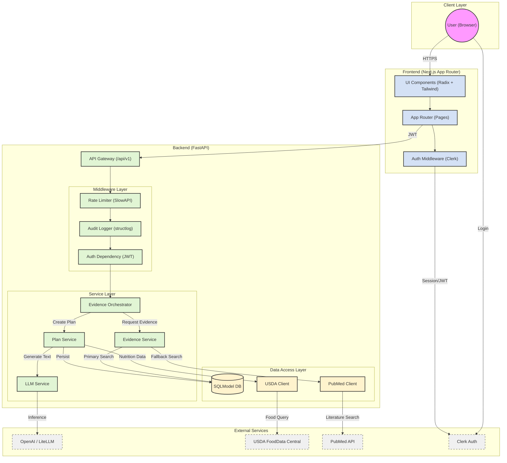

# Annapurna-AI Architecture

This document visualizes the high-level architecture of the Annapurna-AI application, illustrating the flow of data between the Client, Frontend, Backend, and External Services.

## Architecture Diagram

## Component Details

### Frontend
- **Next.js 16**: Uses App Router for routing and server-side rendering.
- **Clerk**: Handles user authentication and session management.
- **Tailwind CSS & Radix UI**: Provides the styling and accessible interactive components.

### Backend
- **FastAPI**: Main application framework.
- **Orchestrator**: Central logic for handling complex flows like "Evidence Retrieval" which combines safety checks, local guideline lookups, and external research searches.
- **Services**:
    - `PlanService`: Manages meal plan creation using LLMs and user preferences.
    - `EvidenceService`: Interfaces with local curated data (IFCT/Guidelines).
- **Middleware**: Includes Rate Limiting (SlowAPI) and detailed structural logging for auditability.

### Data & External
- **SQLModel**: ORM for database interactions.
- **External APIs**: 
    - **USDA**: For accurate food nutrition data.
    - **PubMed**: For fetching scientific abstracts.
    - **OpenAI**: For intelligence and plan synthesis.
