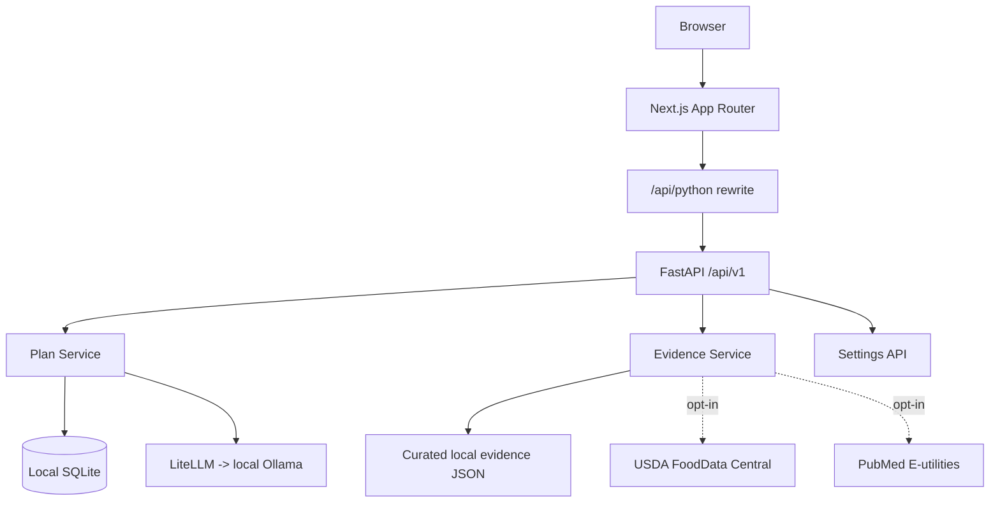

# Architecture

Annapurna-AI is a local-first meal-planning app. The default runtime has no
cloud authentication and no external data fetchers.

```mermaid
graph TB
    User["Browser"] --> Frontend["Next.js App Router"]
    Frontend --> Rewrite["/api/python rewrite"]
    Rewrite --> API["FastAPI /api/v1"]
    API --> PlanService["Plan Service"]
    API --> EvidenceService["Evidence Service"]
    API --> Settings["Settings API"]
    PlanService --> SQLite[("Local SQLite")]
    PlanService --> LLM["LiteLLM -> local Ollama"]
    EvidenceService --> LocalEvidence["Curated local evidence JSON"]
    EvidenceService -. opt-in .-> USDA["USDA FoodData Central"]
    EvidenceService -. opt-in .-> PubMed["PubMed E-utilities"]
```

## Components

- Frontend: Next.js 16, React 19, Tailwind CSS v4, Radix UI, TanStack Query.
- Backend: FastAPI, SQLModel, SQLite, LiteLLM, structlog.
- Local LLM: Ollama by default at `localhost:11434`.
- Optional fetchers: USDA and PubMed, disabled unless
  `ENABLE_EXTERNAL_NETWORK=true` plus the specific fetcher settings.

## Safety Boundaries

The backend validates generated meal-plan JSON before saving it. Medical,
pregnancy, kidney disease, severe allergy, pediatric diet, epilepsy medication,
eating disorder, and extreme weight-loss prompts trigger general wellness
guardrails instead of disease-specific plans.
