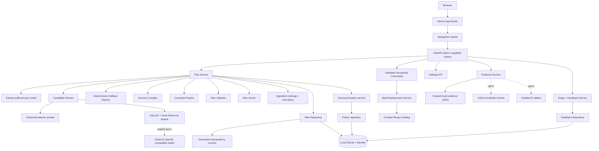

# Architecture

Annapurna-AI is a local-first meal-planning app. The default runtime has no
cloud authentication and no external data fetchers.


```mermaid
graph TB
    User["Browser"] --> Frontend["Next.js App Router"]
    Frontend --> Rewrite["/api/python rewrite"]
    Rewrite --> API["FastAPI /api/v1 capability routers"]
    API --> PlanService["Plan Service"]
    API --> EvidenceService["Evidence Service"]
    API --> Settings["Settings API"]
    PlanService --> PrivacyModel["Family profile privacy model"]
    PlanService --> CandidatePlanner["Candidate Planner"]
    CandidatePlanner --> PromptV1["Versioned planner prompt"]
    CandidatePlanner --> LLM["LiteLLM -> local Ollama by default"]
    PlanService --> FallbackPlanner["Deterministic Fallback Planner"]
    PlanService --> GroceryCompiler["Grocery Compiler"]
    PlanService --> ConstraintEngine["Constraint Engine"]
    PlanService --> PlanValidator["Plan Validator"]
    PlanService --> PlanScorer["Plan Scorer"]
    PlanService --> PlanRepository["Plan Repository"]
    PlanRepository --> Idempotency["Generation idempotency records"]
    PlanService --> Ingredients["Ingredient ontology + normalizer"]
    PlanService --> PantryService["Structured pantry service"]
    PantryService --> PantryRepository["Pantry repository"]
    API --> TodayService["Today + Feedback Service"]
    API --> CommandService["Validated Household Commands"]
    CommandService --> ReplacementService["Meal Replacement Service"]
    ReplacementService --> RecipeCatalog["Curated Recipe Catalog"]
    TodayService --> FeedbackRepository["Feedback Repository"]
    PlanRepository --> SQLite[("Local SQLite + Alembic")]
    PantryRepository --> SQLite
    FeedbackRepository --> SQLite
    LLM -. explicit opt-in .-> CloudLLM["External OpenAI-compatible model"]
    EvidenceService --> LocalEvidence["Curated local evidence JSON"]
    EvidenceService -. opt-in .-> USDA["USDA FoodData Central"]
    EvidenceService -. opt-in .-> PubMed["PubMed E-utilities"]
```

## Components

- Frontend: Next.js 16, React 19, Tailwind CSS v4, Radix UI, TanStack Query.
- Frontend household surfaces: `/plan` for the week, `/pantry` for structured
  local inventory, `/list` for explainable shopping deductions, and `/profile`
  for family planning inputs. Profile sections are isolated UI components;
  parsing remains authoritative on the backend.
- Backend: FastAPI, SQLModel, SQLite, LiteLLM, structlog.
- API boundary: `backend/app/api/routes.py` composes focused health, planning,
  household, pantry, evidence, and settings routers. Handlers validate transport
  input and delegate; they do not own persistence or planning rules.
- Local LLM: Ollama by default at `localhost:11434`.
- Family profile model: role labels, age groups, appetite bands, dietary tags,
  and privacy scope; avoids legal names and medical details.
- Pantry optimizer: uses provided pantry inventory to split grocery output into
  pantry-first, buy/replenish, and use-soon sections.
- Constraint engine: compiles legacy Telugu/Andhra flags and dietary text into
  typed hard constraints and soft planning preferences.
- Plan validator: rejects schema-invalid plans and hard-constraint violations
  such as meat, egg, allergens, onion, or garlic before persistence.
- Plan scorer: ranks valid candidates using configurable heuristic weights for
  pantry and expiry use, preference match, variety, reuse, repetition, and
  waste. Scores are internal ranking signals, not user-facing claims.
- Candidate planner: turns versioned LLM output into one or more candidate
  payloads without deciding whether they are safe or valid.
- Deterministic fallback planner: owns the local seven-day fallback catalog and
  constraint-aware ingredient filtering.
- Grocery compiler: owns canonical ingredient merging, quantified pantry
  subtraction, minimum-stock and manual-item merging, use-soon grouping,
  category/store-affinity hints, and unresolved quantity messaging. Store
  affinity is advisory; retailer access stays behind an optional protocol.
- Plan service: coordinates pantry context, rules, candidate generation,
  validation, ranking, grocery compilation, and persistence.
- Resilience boundary: model calls have configurable timeouts, one bounded retry
  by default, and a small in-process circuit breaker. Exhaustion returns the
  deterministic fallback rather than failing plan generation.
- Meal replacement service: changes exactly one unlocked slot, validates and
  scores deterministic alternatives against saved rules/current pantry, then
  updates grocery deductions without regenerating the week.
- Optional fetchers: USDA and PubMed, disabled unless
  `ENABLE_EXTERNAL_NETWORK=true` plus the specific fetcher settings.
- Optional external LLM endpoint: disabled unless `ENABLE_EXTERNAL_NETWORK=true`
  when `LLM_BASE_URL` is non-local.
- Plan repository: owns plan persistence and latest-plan lookup without exposing
  SQLite behavior to the planning service.
- Generation provenance: every newly saved plan records a generation ID,
  timestamp, provider/model, prompt/planner/validator versions, source status,
  and whether deterministic fallback was used. Existing API routes remain valid.
- Generation idempotency: clients may send `Idempotency-Key`. The backend stores
  the normalized request hash and complete result locally; matching retries
  replay the result, while key reuse with different input returns HTTP 409.
- Ingredient domain: a versioned local JSON ontology plus deterministic name
  and unit normalization. Grocery/pantry identity matching uses canonical IDs;
  unresolved or ambiguous names are preserved rather than guessed.
- Pantry domain: structured inventory and append-only transaction events are
  persisted behind a domain-specific repository. Optimistic item versions
  prevent stale concurrent updates, and legacy free text is parsed only by the
  backend before planning.
- Household activity domain: meal execution status, transparent feedback
  signals, and lightweight leftovers persist locally behind a focused
  repository. `/today` combines these records with the latest plan, current
  pantry expiry, and missing-ingredient deductions.
- Recipe domain: a small validated local catalog separates recipes and
  structured ingredient requirements from generated display text.
- Feedback ranking: explicit signals map to documented title weights and are
  included in later candidate scoring; there is no opaque personalization model.
- Command domain: a deterministic parser compiles supported household phrases
  into typed actions before repositories or domain services mutate state.

## Source and Dependency Boundaries

The current backend dependency direction is:

```text
api routers -> application services/domain rules -> repositories/models
```

- `app/api/routers` groups HTTP handlers by user-facing capability.
- `app/domain/grocery` owns grocery compilation and store-affinity contracts.
- `app/domain/planning` owns constraints, candidates, fallback, validation,
  scoring, and meal replacement.
- `app/domain/pantry`, `feedback`, `commands`, `ingredients`, and `recipes` own
  their corresponding business rules and typed models.
- `app/services` coordinates application workflows and optional external
  adapters; `app/repositories` owns SQLite access.

See [Repository Structure](docs/REPOSITORY_STRUCTURE.md) for placement rules and
[Planner Pipeline](docs/PLANNER_PIPELINE.md) for the generation sequence.

## Observability and API errors

The API accepts or creates a privacy-safe `X-Request-ID`, returns it on every
response, and binds it to structured request logs. Logs contain method, route,
duration, status, provider/model labels, and exception classes—not dietary
payloads, prompt text, keys, or query strings. Domain and validation failures use
a stable `{error: {message, code, request_id}}` envelope.

Offline planning evaluations live in `backend/evals`. They execute only local,
deterministic components and validate invariants rather than exact meal wording.

## Database Migrations

Alembic owns schema changes. Run `cd backend && alembic upgrade head` before
starting the API after an update. The migrations preserve legacy plan JSON and
add structured pantry, meal execution, feedback, and leftover records. Runtime
startup no longer mutates the schema with `create_all`. The fourth migration
adds local plan-generation idempotency records.

## Safety Boundaries

The backend validates generated meal-plan JSON before saving it. Medical,
pregnancy, kidney disease, severe allergy, pediatric diet, epilepsy medication,
eating disorder, and extreme weight-loss prompts trigger general wellness
guardrails instead of disease-specific plans.
