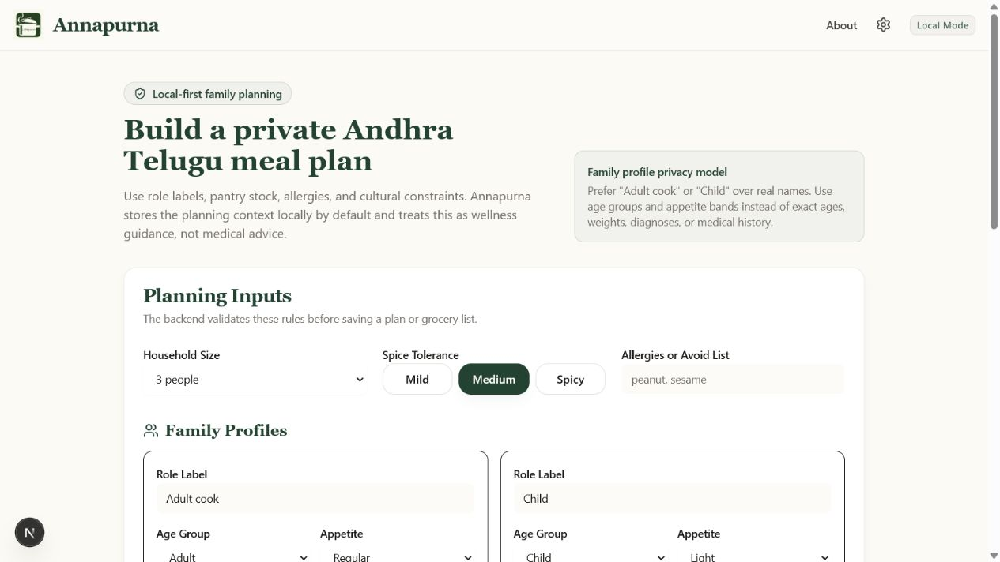
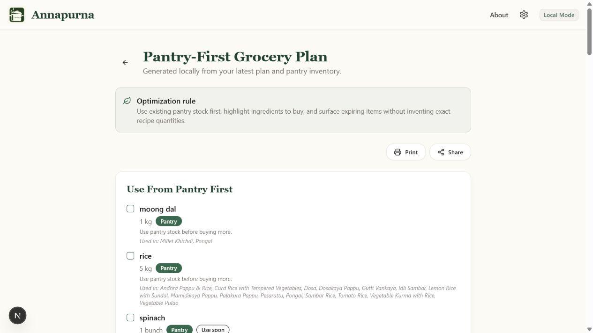

# Annapurna-AI

Annapurna-AI is a local-first, culturally aware planning app for Andhra Telugu
vegetarian home cooking. It uses FastAPI, SQLite, LiteLLM/Ollama, and Next.js to
generate weekly meal plans, pantry-aware grocery lists, and privacy-preserving
family planning context while keeping local data on your machine by default.

This is a privacy-aware reference implementation for general wellness planning.
It does not provide medical advice, diagnosis, treatment, or clinical nutrition
plans.

## What Stays Local

- Meal plans and grocery lists are stored in local SQLite.
- Family profiles use role labels, age groups, appetite bands, and dietary tags
  instead of legal names, exact ages, weights, or diagnoses.
- Pantry inventory and Telugu/Andhra dietary constraints are stored with the
  generated plan context locally by default.
- The default LLM endpoint is local Ollama at `http://localhost:11434`.
- USDA and PubMed fetchers are disabled by default.
- No analytics, telemetry, Sentry, PostHog, or LangSmith hooks are included.

See [LOCAL_FIRST.md](LOCAL_FIRST.md) for the full privacy posture.
See [docs/LOCAL_FIRST_PRODUCT_REFRAME.md](docs/LOCAL_FIRST_PRODUCT_REFRAME.md)
for the PM and privacy-by-design reframe.

## Product Capabilities

- Privacy-preserving family profiles with role labels, age bands, appetite, and
  scoped dietary tags.
- Pantry inventory intake with quantity and expiry hints.
- Grocery optimization that separates pantry-first items, buy/replenish items,
  and pantry items to use soon.
- Telugu/Andhra dietary rules for vegetarian, no egg, rice-based lunch, daily
  pappu/dal, fermented breakfasts, child-friendly spice, and festival no
  onion/garlic planning.
- Rule-based validation tests that reject malformed model output and cultural
  constraint violations before saving.
- Local-vs-cloud model boundary: non-local LLM endpoints require
  `ENABLE_EXTERNAL_NETWORK=true`.

## Screenshots

Screenshots are stored in [docs/screenshots](docs/screenshots).





## Sample Plans

See [docs/SAMPLE_MEAL_PLANS.md](docs/SAMPLE_MEAL_PLANS.md) and
[backend/app/data/sample_meal_plans/andhra_telugu_family_week.json](backend/app/data/sample_meal_plans/andhra_telugu_family_week.json).

## Tech Stack

| Area | Version / Tooling |
| --- | --- |
| Frontend | Next.js 16.2.6, React 19.2.3, TypeScript, Tailwind CSS v4 |
| UI | Radix UI, lucide-react, TanStack Query |
| Backend | FastAPI, SQLModel, SQLite, aiosqlite |
| LLM | LiteLLM with local Ollama by default |
| Quality | Ruff, Pytest, ESLint 9, npm audit |
| Containers | Docker Compose with a backend service and optional Ollama profile |

## Quick Start

### 1. Install Ollama

Install Ollama from [https://ollama.com](https://ollama.com), then pull the
default model:

```bash
ollama pull llama3.2:latest
```

### 2. Clone

```bash
git clone https://github.com/Anudeepsrib/Annapurna-AI.git
cd Annapurna-AI
```

### 3. Backend

macOS/Linux:

```bash
cd backend
python3 -m venv venv
source venv/bin/activate
pip install -r requirements.txt
cp ../env.example .env
python -m uvicorn app.main:app --host 127.0.0.1 --port 8000 --reload
```

Windows PowerShell:

```powershell
cd backend
python -m venv venv
.\venv\Scripts\Activate.ps1
pip install -r requirements.txt
Copy-Item ..\env.example .env
python -m uvicorn app.main:app --host 127.0.0.1 --port 8000 --reload
```

### 4. Frontend

In a second terminal:

```bash
npm install
npm run dev
```

Open [http://localhost:3000](http://localhost:3000).

## Setup Scripts

The setup helpers are optional:

```bash
bash scripts/setup.sh
```

```powershell
.\scripts\setup.ps1
```

The Windows command is `.\scripts\setup.ps1`.

## Docker Compose

Backend with host Ollama:

```bash
docker compose up --build backend
```

Optional Ollama container profile:

```bash
docker compose --profile ollama up --build
```

If you use the Ollama profile, pull a model into that container before
generating plans:

```bash
docker compose --profile ollama exec ollama ollama pull llama3.2:latest
```

## Configuration

Copy `env.example` to `backend/.env` for backend settings. Defaults are local:

```env
APP_ENV=development
DEBUG=false
CORS_ORIGINS=http://localhost:3000,http://127.0.0.1:3000
DATABASE_URL=sqlite+aiosqlite:///./annapurna.db
LLM_PROVIDER=ollama
LLM_BASE_URL=http://localhost:11434
LLM_MODEL=llama3.2:latest
ENABLE_EXTERNAL_NETWORK=false
ENABLE_USDA=false
ENABLE_PUBMED=false
```

Use `.env.local` only for frontend settings such as `BACKEND_URL` or
`NEXT_PUBLIC_API_BASE_PATH`. Do not put secrets in `NEXT_PUBLIC_*` variables.

## Optional External Fetchers

USDA and PubMed are off by default. To enable either fetcher, you must set:

```env
ENABLE_EXTERNAL_NETWORK=true
```

USDA also requires `ENABLE_USDA=true` and `USDA_API_KEY`.
PubMed also requires `ENABLE_PUBMED=true` and `PUBMED_EMAIL`.

## Local vs Cloud Models

Local model mode is the default:

```env
LLM_PROVIDER=ollama
LLM_BASE_URL=http://localhost:11434
ENABLE_EXTERNAL_NETWORK=false
```

External model mode is opt-in. If `LLM_BASE_URL` points to a non-local host,
the backend requires:

```env
ENABLE_EXTERNAL_NETWORK=true
```

In external mode, family profile labels, pantry inventory, allergies, and
dietary prompts may leave the machine as model prompt data. Keep local mode for
private household planning.

## Safety Boundaries

Annapurna-AI returns general wellness guidance only. It is not a medical device,
diagnosis tool, treatment planner, or clinical nutrition system. Prompts involving diabetes,
pregnancy, kidney disease, eating disorders, severe allergies, epilepsy
medication interactions, pediatric diets, or extreme weight-loss goals trigger
guardrails advising review with a qualified clinician or registered dietitian.

Nutrition estimates are approximate. The app does not claim HIPAA, GDPR,
medical, or clinical compliance.

## Validation

Backend:

```bash
python -m compileall backend/app
cd backend
pip install -r requirements.txt
pip check
pytest
ruff check .
python -m uvicorn app.main:app --host 127.0.0.1 --port 8000
```

Frontend:

```bash
npm install
npm run lint
npm run build
npm audit
```

Docker:

```bash
docker compose config
docker compose build
```

## Troubleshooting

Ollama not running:

```bash
ollama list
ollama serve
```

Model not pulled:

```bash
ollama pull llama3.2:latest
```

Invalid LLM JSON:

The backend validates model output. If the model returns malformed JSON or
missing fields, the app uses a deterministic fallback plan and marks the source
status as `fallback_invalid_llm_json`.

SQLite permission issue:

Check that the backend process can write to `backend/annapurna.db` or the Docker
volume mounted at `/app/data`.

CORS issue:

Set `CORS_ORIGINS` in `backend/.env`, for example:

```env
CORS_ORIGINS=http://localhost:3000,http://127.0.0.1:3000
```

Offline backend from frontend:

Confirm FastAPI is listening at [http://127.0.0.1:8000/health](http://127.0.0.1:8000/health).
