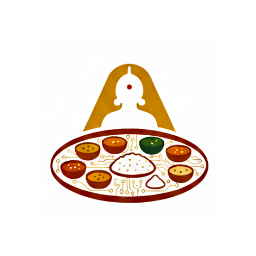

<div align="center">
  
  
  <h1 style="margin-top: 0;">Annapurna-AI 🍚</h1>
  
  <p><b>"Clone it. Run it. Own it. Your food data never leaves your machine."</b></p>
  
  <p>A fully local, privacy-first AI meal planner meticulously crafted for authentic South Indian, Andhra Telugu vegetarian cooking.</p>

  <p>
    <a href="#-core-features">Features</a> •
    <a href="#-quick-start">Quick Start</a> •
    <a href="#%EF%B8%8F-tech-stack">Data & Tech Stack</a> •
    <a href="#-models--llms">Models</a>
  </p>
</div>

---

## 🔒 The Privacy-First Promise

Annapurna-AI is built on the philosophy of complete data sovereignty. You don't need a SaaS subscription to eat well.

<table>
  <tr>
    <td width="50%" valign="top">
      <h3>🚫 Zero Cloud Auth</h3>
      <p>No accounts, passwords, or sign-ups required. Your identity is your own machine.</p>
    </td>
    <td width="50%" valign="top">
      <h3>🧠 Local LLM Processing</h3>
      <p>Powered locally via Ollama or LM Studio. Your dietary preferences never ping a remote cloud server.</p>
    </td>
  </tr>
  <tr>
    <td width="50%" valign="top">
      <h3>💾 Sovereign SQLite</h3>
      <p>All data, generated plans, and fetched evidence live inside a single <code>annapurna.db</code> file that you alone own and control.</p>
    </td>
    <td width="50%" valign="top">
      <h3>📡 Zero Telemetry</h3>
      <p>No hidden analytics, tracking, or data harvesting. External APIs (USDA/PubMed) are strictly opt-in.</p>
    </td>
  </tr>
</table>

---

## ✨ Core Features

<table>
  <tr>
    <td width="33%" valign="top">
      <b>🍲 Cultural Authenticity</b><br/>
      Home-style Andhra Telugu meal patterns. Enforces rice-centric pairings, traditional dals, and spice profiles. Zero generic "Western" diet defaults.
    </td>
    <td width="33%" valign="top">
      <b>📅 Intelligent Planning</b><br/>
      Generates structured weekly plans (Breakfast, Lunch, Dinner) optimized for ingredient reuse and zero food waste.
    </td>
    <td width="33%" valign="top">
      <b>🛒 Automated Groceries</b><br/>
      Instantly compiles grocery lists based on your weekly generated meals, categorized intuitively.
    </td>
  </tr>
  <tr>
    <td width="33%" valign="top">
      <b>📚 Evidence-Backed</b><br/>
      Grounded in ICMR/NIN guidelines. Optional NIH/PubMed fetching for nutritional literature support.
    </td>
    <td width="33%" valign="top">
      <b>🎨 Premium UI</b><br/>
      A beautiful, organic, culturally-aligned interface built with Tailwind v4 and React.
    </td>
    <td width="33%" valign="top">
      <b>🎛️ Bring Your Own AI</b><br/>
      Plug in any GGUF model via LiteLLM. Works seamlessly with local edge models like Llama 3.2 or Mistral.
    </td>
  </tr>
</table>

---

## 🚀 Quick Start

Get up and running locally in under 5 minutes.

### 1. Engine Setup
Ensure you have [Ollama](https://ollama.com) installed and pull a lightweight model:
```bash
ollama pull llama3.2:latest
```

### 2. Clone & Bootstrap
```bash
git clone https://github.com/Anudeepsrib/Annapurna-AI.git
cd Annapurna-AI

# Run the automated setup script
# macOS/Linux:
bash scripts/setup.sh

# Windows:
.\scripts\setup.ps1
```

### 3. Launch
Launch two terminal windows to start the backend engine and frontend interface.

**Terminal 1 — Local Backend Server:**
```bash
cd backend
source venv/bin/activate  # Windows: .\venv\Scripts\activate
python -m uvicorn app.main:app --reload
```

**Terminal 2 — Next.js Frontend:**
```bash
npm run dev
```

Open [http://localhost:3000](http://localhost:3000) to begin planning your meals.

---

## 🛠️ Tech Stack

<table>
  <tr>
    <th width="50%">Frontend (App Router)</th>
    <th width="50%">Backend (Data Engine)</th>
  </tr>
  <tr>
    <td valign="top">
      <ul>
        <li><b>Framework:</b> Next.js 14</li>
        <li><b>Styling:</b> Tailwind CSS v4 + Radix UI</li>
        <li><b>State:</b> TanStack Query</li>
        <li><b>Language:</b> TypeScript</li>
      </ul>
    </td>
    <td valign="top">
      <ul>
        <li><b>API:</b> FastAPI (Python 3.11+)</li>
        <li><b>Database:</b> SQLModel + aiosqlite</li>
        <li><b>Orchestration:</b> LiteLLM</li>
        <li><b>Logging:</b> Structlog</li>
      </ul>
    </td>
  </tr>
</table>

---

## 🧠 Models & LLMs

We recommend local models with at least 3 Billion parameters for optimal JSON formatting and culinary coherence.

| Model | Resource Size | Quality/Speed | Best Use Case |
|-------|---------------|---------------|---------------|
| **Llama 3.2 3B** | `~2GB RAM` | ⚡ Fast / Good | Quick iterations, older hardware. |
| **Llama 3.2 7B** | `~4GB RAM` | ⚖️ Balanced | The sweet spot for detail and velocity. |
| **Mistral 7B** | `~4GB RAM` | 🎨 Creative | Excellent meal variety and structure. |
| **Phi-3 Mini** | `~2GB RAM` | 🔋 Efficient | Battery-friendly edge computing. |

---

## ⚙️ Configuration

Your instance can be customized entirely via the `backend/.env` file:

```env
# AI Provider targeting a local Ollama instance
LLM_PROVIDER=ollama
LLM_BASE_URL=http://localhost:11434
LLM_MODEL=llama3.2:latest

# Local Database Persistence
DATABASE_URL=sqlite+aiosqlite:///./annapurna.db

# Optional Data Fetchers (Disabled by Default for Privacy)
ENABLE_USDA=false
ENABLE_PUBMED=false
# PUBMED_EMAIL=annapurna-ai@example.com
```

---

## ⚠️ Disclaimer
**General Wellness Only:** Annapurna-AI is an educational software project. It does **not** provide medical advice, diagnosis, or treatment protocols. Users with specific medical conditions should consult a qualified healthcare professional.

---
<div align="center">
  <p>Built with ❤️ for South Indian Kitchens.</p>
</div>
